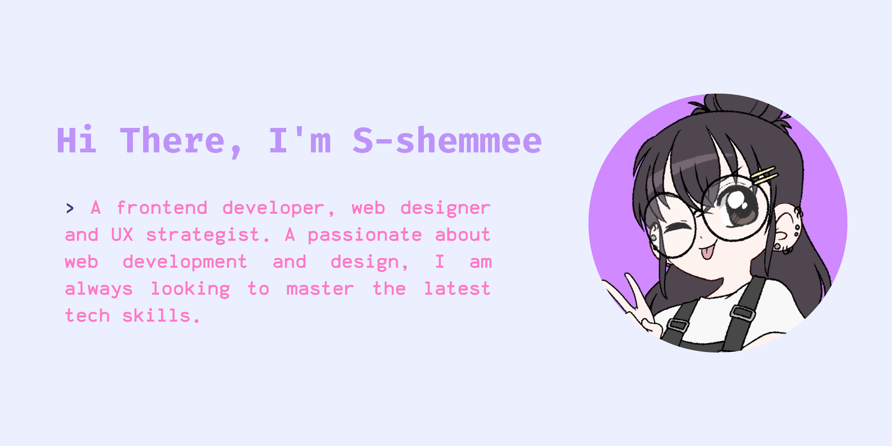

<div align="center">
  
</div>
<h2>A little more about me...  </h2>
  
```javascript
const s-shemmee = {
    pronouns: "She" | "Her",
    technologies: {
        frontEnd: {
            js: ["Vue", "React", "Angular"],
            css: ["bootstrap", "sass"]
        },
        backEnd: ["Python", "Ruby"],
        databases: ["MySql", "oracle"],
    }
};
```


---  


---
####  <em><b>Always up for a chat about web development or design, check out some of my work on Github!</b> :)</em>
---

